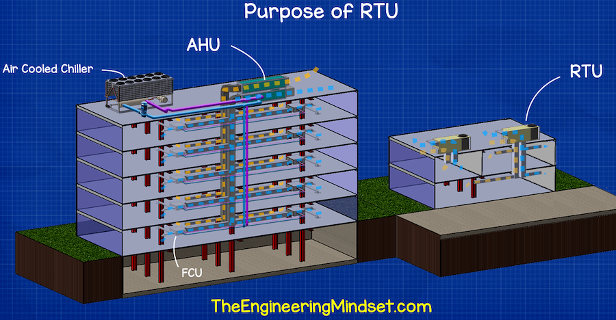

There is a special kind of modern miracle that defines our modern day, and it transcends the day-lengthening magic of the electric light into the artificial climates that bring us comfort and productivity in the hottest months.

This is what air-conditioning has accomplished so thoroughly that we barely notice it anymore. It has made climate fade into the background hum of our lives. It has turned summer into a manageable inconvenience instead of a season of languid suffering.

Commercial cooling is not one technology but a stack of interlocking systems. Most approaches solve the same problem in the same way: move heat from where people are to someplace else, and do it fast so nobody complains.

## Cooling is actually moving heat

Air-conditioning is often described as making cold. That's not quite it. Air conditioning removes heat.

That distinction matters because it explains why cooling equipment is so large, why it uses so much electricity, and why cities feel hotter when everyone runs their air-conditioning at once. A commercial HVAC system is a machine for collecting unwanted heat from indoor air and pushing it somewhere else.

Almost every commercial cooling system mimics the same basic thermodynamic cycle. A refrigerant is a fluid that has a unique relationship between its boiling point and its pressure, tuned so that they can cycle between a desired indoor temperature and a higher outdoor temperature. At low pressures, the refrigerant boils, which requires a lot of energy, at a low temperature and thus absorbs heat from indoor air. 

The refrigerant is then compressed to a high pressure and temperature and moved to the outside-facing portion of the system. At high pressures, the refrigerant condenses at a higher temperature than the outdoor air and rejects that heat outside. The refrigerant is then expanded back to a low pressure liquid and the cycle repeats as it boils at room temperature and absorbs heat from indoor air again.

People produce heat. Lights produce heat. Computers, elevators, kitchen equipment, sunlight through glass, and warm ventilation air all produce heat. Cooling is the organized labor of carrying that heat away.

In many cities, window mounted AC units are the most visible form of cooling, but they rarely appear in commercial buildings. We'll discuss rooftop units and chilled-water systems as the most common approaches, but there are many other ways to move heat. Some buildings use fan-coil systems, variable refrigerant flow systems, or even ice storage. The details vary, but the goal is always the same: move heat from where people are to someplace else.

## Most Common: rooftop units

The simplest commercial buildings often rely on rooftop units, or RTUs. If you have ever looked up at the roofline of a low-rise retail center, a suburban office building, a school, or a warehouse and seen a row of gray or beige boxes, you have seen a RTU.

 

Rooftop units are popular for a reason. They are compact, relatively standardized, and straightforward to install. They combine supply fans, compressors, refrigerant circuits, and controls in one packaged box. They pull in building air, cool it, and push it back through ducts into occupied space.

Their strengths:

- They are familiar to contractors and operators
- They are easy to deploy in smaller or simpler buildings
- They keep major equipment out of tenant space
- They can serve independent zones reasonably well

Their weaknesses:

- Poor efficiency, especially in older units
- They can be blunt instruments for buildings with varying internal loads
- They do not scale efficiently for dense high-rise commercial towers

Rooftop units are like the pickup trucks of commercial cooling. They are reliable, common, hardworking, but not especially elegant.

## Upgrade Pick: chilled-water systems

In larger commercial buildings, especially offices, hospitals, campuses, and high-rises, cooling is usually more centralized. Instead of placing a packaged unit above every major zone, the building makes chilled water in a plant called a chiller and sends that water around the building to pick up heat and push it outside.

A chiller is, in effect, a larger and more sophisticated cooling machine that cools water instead of directly cooling occupied air. That chilled water is pumped to air-handling units, fan-coil units, or other terminal equipment, where it absorbs heat from indoor air. The warmed water returns to the chiller plant, and the cycle continues.

This arrangement has several advantages:

- It scales well for large buildings
- It allows central optimization instead of scattered equipment across the building
- It can provide better efficiency at large tonnage
- It gives operators more flexibility over sequencing and plant control

It also introduces complexity:

- Pumps, valves, controls, cooling towers, and heat exchangers introduce more points of failure
- Failures in the central plant can affect the entire building instead of just one zone
- Operations quality becomes as important as equipment quality
- Retrofitting can be difficult in occupied buildings

Still, if rooftop units are the pickup truck, the central chiller plant is the rail network. More infrastructure and more coordination, but more effective.

## Air-side systems: how the cool reaches people

No matter how the cooling is generated, whether by a chilled water system or a rooftop unit (RTU), a building still has to deliver comfort to human bodies. That is where the air-side system comes in.

In many office buildings, large air-handling units condition and circulate air through ductwork. They cool air by blowing it across chilled-water coils or refrigerant coils, then send that air through floors, zones, or tenant areas. Return air comes back, mixes with outdoor ventilation air, and the process begins again.

Some buildings rely more heavily on variable air volume systems, known as VAV. These are now common in commercial office stock. The central system supplies cool air, and local VAV boxes adjust the quantity delivered to each zone.

The strength of VAV is control. One conference room can be packed while the office next door sits half empty. A south-facing office might be baking in a strong midafternoon sun while the core of the building remains at a mild temperature. VAV lets the building modulate airflow instead of dictating one temperature across the entire building.

## Cooling towers: the machines people forget to look at

If the chiller plant is the brain of many large commercial cooling systems, the cooling tower is the loud, unglamorous lung.

Water-cooled chillers reject heat through condenser-water loops that ultimately dump that heat through cooling towers, often perched on rooftops. Cooling towers use evaporative cooling to help transfer waste heat from the chiller by spraying hot water into the air and collecting the cooled water. They are essential to the efficiency of many large buildings, yet they are rarely part of the public imagination of air-conditioning.

They are the reason many high-rise systems can outperform simpler air-cooled alternatives. They are also one more layer of pumps, fans, water treatment, and maintenance that must work correctly.

## The strengths of the current system

It is worth saying clearly that modern commercial cooling works astonishingly well.

It cools glass towers, hospitals, labs, schools, server rooms, hotels, and shopping centers. It allows office work, medical care, food storage, and urban life to proceed through heat waves that would otherwise become intolerable. It is one of the invisible foundations of modern productivity.

The current commercial cooling stack:

- Is proven
- Is understood by a large service ecosystem
- Is highly effective at maintaining comfort
- Can be tuned for almost any building type
- Has decades of engineering precedent behind it

## The weaknesses of the current system

And yet the maturity of the current system has also locked in nearly a century of inefficiency.

Most commercial cooling is still profoundly synchronous. Buildings wait for the hottest hours of the day, then work hardest exactly when the grid is most stressed and electricity is most expensive. They create cold in real time because that is how most systems were built to operate and how most owners have accepted as the status quo.

This is not irrational or negligent. It is, however, very costly.

The result is familiar:

- Afternoon peaks drive utility demand charges on the order of tens of thousands of dollars for a single building
- Equipment is sized around extreme conditions that last only a few hours per year, which is expensive and inefficient
- Operators face sharp tradeoffs between cost, comfort, and simplicity
- Cities dump enormous amounts of rejected heat into already-hot streets, furthering the heat island effect

Commercial cooling is good at comfort but often clumsy at timing.

## Why this matters now

That timing problem is becoming harder to ignore.

The electric grid is under more pressure from extreme heat. Electrification is pushing more end uses onto power systems. Office owners are under pressure to reduce emissions, lower operating costs, and modernize old buildings without tearing them apart. Meanwhile, there is a growing difference between cheap nighttime electricity and expensive daytime peak power, which buildings are not yet optimized to take advantage of.

This is why the next chapter in commercial cooling may not be about abandoning existing HVAC systems. It might just be about making existing systems smarter and more capable with a few targeted upgrades.

Thermal storage is one version of that. Better controls are another. Improved ventilation optimization, load forecasting, and demand management all belong to the same family of ideas that ask if we can make our buildings more efficient without sacrificing comfort.

## Wrapping it up

Commercial cooling today is a triumph of mechanical and civil engineering. It's also a beautifully human problem that goes largely unnoticed until something breaks. Unfortunately, breaking is more and more common as the grid strains under the heat waves of climate change, electrification, and aging infrastructure.

It keeps millions of people comfortable. It also commits many buildings to an expensive daily ritual: consume the most power when power is most problematic. The existing HVAC landscape is full of ingenuity and advancement, but it is also full of inertia.

But this is what makes cooling interesting. It is not a solved problem. It is a solved comfort problem inside a still-unsolved energy problem.

