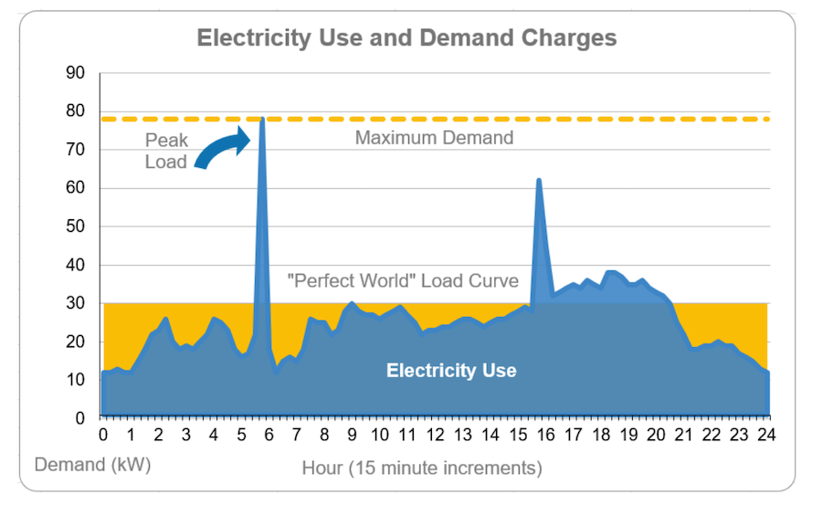

# Demand charges in NYC office buildings and what an ice battery can do

New York City is a strong market for thermal storage because large commercial buildings do not just pay for energy. They also pay for peak power.

For many large commercial customers, one hot afternoon can create a demand spike that affects the entire month's bill. That is exactly the kind of problem an ice battery can help solve.

## Why demand charges matter so much in NYC

Con Edison separates large commercial customers into rate classes where demand matters. Its rate education [page](https://rates.coned.com/rates/commercial/understanding-rates) distinguishes smaller commercial service from larger customers whose bills include demand charges. In parallel, Con Edison explains that commercial and industrial customers pay demand charges because they require more expensive grid equipment and because the utility must stand ready to serve their highest usage interval.

NYSERDA's [real time energy management (RTEM)](https://www.nyserda.ny.gov/All-Programs/Real-Time-Energy-Management) makes the point even more directly: for a large commercial electricity customer in New York City, demand delivery charges can account for **roughly 30% to 70% of the total monthly electricity cost**, often exceeding the energy charge itself.

That is exactly why cooling matters. Cooling is one of the largest flexible electric loads in an office tower, and it tends to peak at the same time the city peaks.

## A NYC office case study

Assume a Manhattan office building with these characteristics:

- 100,000 square feet (ex: [Figma's Flatiron Office](https://businessfacilities.com/figma-will-create-242-tech-jobs-in-manhattans-flatiron-district/))
- Existing electric chiller plant serving summer cooling
- Summer peak cooling load around 450 kW
- Annual cooling energy around 720,000 kWh
- Effective demand charge around $30/kW-month during the cooling season
- Electricity price around $0.18/kWh blended
- Six meaningful cooling months per year

These numbers are representative of what NYC office owners already see: high summer demand charges and expensive daytime cooling.

Under that setup:

- Baseline annual cooling-related demand charges are about `450 kW x $30/kW x 6 months = $81,000`
- Baseline annual cooling energy charges are about `720,000 kWh x $0.18/kWh = $129,600`
- Total annual cooling bill is about `$210,600`

That means demand charges alone are about 38% of this simplified cooling bill. That lands squarely inside the range NYSERDA highlights for large New York City commercial customers.

## Ice batteries shift peaks

Now assume an ice battery shifts 40% of the building's peak cooling load out of the expensive interval.

- Peak load shifted: `450 kW x 40% = 180 kW`
- Annual demand-charge savings: `180 kW x $30/kW x 6 months = $32,400`

If the system also shifts roughly 230,000 kWh of annual cooling energy to lower-cost nighttime operation, and if that shifted energy is effectively 35% cheaper, then:

- Annual energy-charge savings are about `230,000 kWh x $0.18/kWh x 35% = $14,490`

Total modeled annual savings are then about:

- `$32,400 + $14,490 = $46,890`

That is about 22% of the simplified annual cooling bill.

Some notes here:
- Most of the value comes from lowering the hottest-hour kW spike
- A smaller but still significant share comes from moving cooling work to nighttime

CALMAC's [overview](https://www.calmac.com/understanding-your-electricity-bill) of commercial electricity bills says demand is often 40% to 60% of the total bill for North American commercial and industrial customers and notes that in many systems only a portion of cooling load needs to be shifted to materially lower the bill.

NYSERDA's demand-management resources state that demand delivery charges for a large commercial electricity customer in New York City can be 30% to 70% of the monthly electricity bill. In NYC, peak kW is as important as, and usually more important than, total kWh.

### Rockefeller Center

Rockefeller Center is one of the clearest proof points of ice storage in NYC. It is a large, high-profile office and retail complex with a central chiller plant that serves multiple buildings.

According to CALMAC's [case study](https://www.calmac.com/energy-storage-case-study-rockefeller-center):

- The central plant serves roughly 8 million rentable square feet across ten buildings
- The site has 14,500 tons of steam and electric chillers
- The ice system was sized to provide 8,600 ton-hours of thermal storage
- The project provided 1,025 kW of thermal energy storage

During peak-demand periods, cooling from the ice storage tanks is used instead of running another electric chiller. The case study quotes Joseph Szabo saying that turning on large chillers can result in large electrical demand cost penalties, especially in New York City with its high electrical-demand utility rate structure.

Before storage, the plant would run one 4,000-ton steam turbine chiller, one 4,000-ton electric chiller, and one 2,500-ton electric chiller on peak cooling days. After incorporating the ice melt, the operators were able to avoid bringing the 2,500-ton electric chiller online during the key 15-minute interval that sets the demand charge, and thus the monthly bill.

## Where an ice battery works best

The economics are strongest when a building has:

- High summer afternoon cooling peaks
- Existing chilled-water or central plant infrastructure
- Large enough load for demand charges to matter
- Nighttime operating flexibility for charging storage
- An owner that is willing to invest upfront for long-term savings

The economics are weaker when:

- Cooling loads are already flat and modest
- The building has little demand-charge exposure
- The HVAC system is too fragmented to retrofit cleanly

## Wrapping it up

For large NYC office buildings, demand charges are a primary driver of high utility costs for cooling.

For a city full of office buildings with expensive cooling peaks, ice batteries are not exotic or risky. They are a practical way to buy less electricity at critical moments.